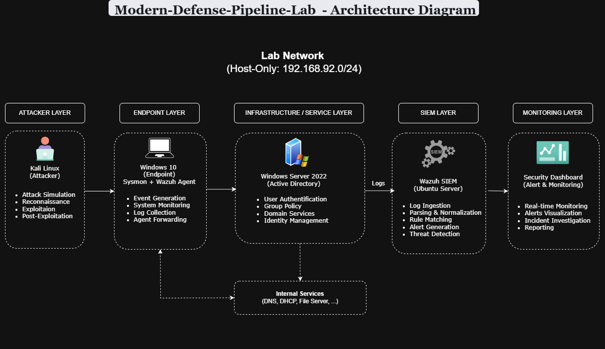

# Modern SOC Detection & Response Lab (Wazuh SIEM)

## 🧠 Overview

This project is a fully simulated Security Operations Center (SOC) environment designed to demonstrate real-world security monitoring, detection engineering, and incident response workflows using open-source tools.

The lab replicates a small enterprise network where logs are collected, analyzed, and used to detect malicious activities such as brute-force attacks and system persistence techniques.

---

## 🎯 Objectives

- Build a realistic SOC home lab environment
- Centralize log collection using a SIEM (Wazuh)
- Generate and analyze security events from multiple endpoints
- Detect malicious activities using custom rules
- Simulate real attack scenarios using Kali Linux
- Practice incident detection and response workflows

---

## 🏗️ Architecture

### Components:
- Windows Server (Active Directory Domain Controller)
- Windows 10 Endpoint (User Machine)
- Kali Linux (Attacker Machine)
- Wazuh SIEM (Monitoring & Detection Platform)
- Sysmon (Advanced Windows Logging)

---

## ⚙️ Tech Stack

- Wazuh SIEM
- Sysmon
- Windows Server / Windows 10
- Kali Linux
- VMware

---

## 🔄 Data Flow

1. Endpoints generate security logs (Windows Event Logs + Sysmon)
2. Wazuh agents collect and forward logs
3. Wazuh manager processes and normalizes events
4. Detection rules analyze suspicious behavior
5. Alerts are generated and visualized in dashboards

---

## ⚔️ Attack Lifecycle Scenarios

This lab simulates a full cyber attack chain following real-world attacker behavior:

### 1. Reconnaissance
- Port scanning to identify exposed services

### 2. Initial Access
- Brute force / password spraying attacks

### 3. Execution
- Suspicious PowerShell commands execution

### 4. Persistence
- Registry modifications for long-term access

### 5. Privilege Escalation
- Gaining elevated system privileges after compromise

---

## 🧪 Detection Engineering

This project includes custom detection rules such as:

- Brute force login detection
- Suspicious registry modification alerts
- Multiple failed authentication correlation
- Sysmon-based behavioral detection

---

## 📊 Dashboards

Wazuh dashboards are used to visualize:

- Authentication failures
- Active alerts
- Endpoint activity
- Attack patterns over time

---

## 🚨 Incident Response Workflow

1. Alert triggered by SIEM
2. Triage and severity classification
3. Log investigation (Wazuh + Sysmon)
4. Root cause analysis
5. Incident report generation

---
