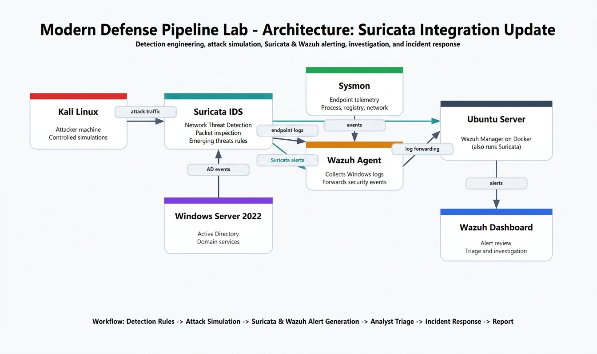
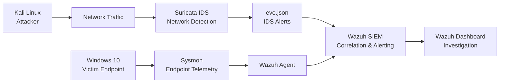

# Modern Defense Pipeline Lab

## Overview

Modern Defense Pipeline Lab is a hands-on cybersecurity project that simulates a small enterprise security environment and documents the workflow of a SOC analyst from detection engineering to incident reporting.

The goal of this lab is to demonstrate the full workflow of a security analyst: from detection engineering and attack simulation to alert validation, investigation, incident response, and final reporting.

## Project Goal

The goal of this project is to demonstrate a practical defensive pipeline:

```text
Attack Simulation
-> Telemetry Collection
-> SIEM Detection
-> Alert Triage
-> Investigation
-> Response
-> Incident Report
```

## Lab Environment

The lab uses the following systems:

| System | Role |
|---|---|
| Windows 10 Pro | Target endpoint monitored by Wazuh Agent |
| Windows Server Datacenter 2022 | Active Directory domain controller |
| Kali Linux | Attacker machine used for controlled simulations |
| Ubuntu Server | SIEM server running Wazuh Manager with Docker and Suricata IDS environment |

## Tools And Technologies

- Wazuh Manager
- Wazuh Agent
- Wazuh Dashboard
- Docker
- Sysmon
- Windows Security Logs
- Suricata IDS
- Suricata `eve.json`
- Active Directory
- Kali Linux attack tools
- MITRE ATT&CK

## Detection Scenarios

| Scenario | Purpose | Status |
|---|---|---|
| Port Scan Detection | Detect reconnaissance using Suricata and Wazuh | Completed |
| SSH Brute Force Detection | Detect repeated failed authentication attempts | Completed |
| Suspicious PowerShell Detection | Detect post-compromise command execution | Completed |
| Registry Persistence Detection | Detect Registry Run Key persistence | Completed |
| Privilege Escalation Detection | Detect unauthorized administrator group membership | Completed |

## Architecture





## Validated Scenarios

| Scenario | Evidence | MITRE ATT&CK |
|---|---|---|
| Port Scan Detection | Nmap, Suricata `eve.json`, Wazuh alert | T1046 |
| SSH Brute Force Detection | Hydra, Windows Event ID 4625, Wazuh alert | T1110 |
| Suspicious PowerShell Detection | Windows Event ID 4688, Wazuh custom rule | T1059.001 |
| Registry Persistence Detection | Sysmon Event ID 13, Registry Run Key alert | T1547.001 |
| Privilege Escalation Detection | Windows Event ID 4732, administrator group change alert | T1484 - Privilege Escalation |

## Repository Structure

```text
docs/
lab-environment/
wazuh-siem/
endpoint-security/
network-security/
detection-engineering/
attack-simulation/
incident-response/
reports/
screenshots/
```

## Project Status

Status: ~ Completed

| Phase | Status |
|---|---|
| Lab environment setup | Completed |
| Wazuh SIEM deployment | Completed |
| Endpoint telemetry setup | Completed |
| Suricata IDS integration | Completed |
| Detection engineering | Completed |
| Attack simulation | Completed |
| Alert validation | Completed |
| Incident response documentation | Completed |
| Final reporting | In Progress |

---

## Author

**Othmane Benmezian**  
Entry-Level SOC Analyst | Blue Team | Cybersecurity / SOC Analyst Portfolio Project

This project was created as a hands-on lab to demonstrate practical skills in detection engineering, SIEM monitoring, attack simulation, incident triage, response, and reporting.

This project was created as a hands-on lab to demonstrate practical skills in detection engineering, SIEM monitoring, attack simulation, incident response, and security reporting.
