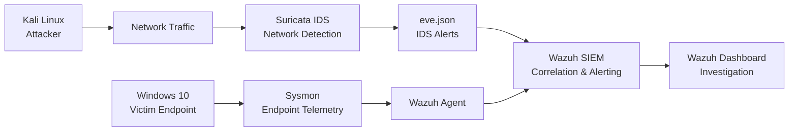

# Modern Defense Pipeline Lab

## Overview

Modern Defense Pipeline Lab is a hands-on cybersecurity project designed to simulate a small enterprise security environment.

The goal of this lab is to demonstrate the full workflow of a security analyst: from detection engineering and attack simulation to alert validation, investigation, incident response, and final reporting.

## Project Goal

This project builds a realistic defensive pipeline where security events are collected from monitored endpoints, analyzed inside a SIEM, matched against detection rules, and investigated as security incidents.

The lab focuses on documenting the complete journey:

```text
Detection Rules
-> Attack Simulation
-> Alert Generation
-> Analyst Triage
-> Incident Response
-> Incident Report
```

## Lab Environment

The lab uses the following systems:

| System | Role |
|---|---|
| Windows 10 Pro | Target endpoint monitored by Wazuh Agent |
| Windows Server Datacenter 2022 | Active Directory domain controller |
| Kali Linux | Attacker machine used for controlled simulations |
| Ubuntu Server | SIEM server running Wazuh Manager with Docker |

## Tools And Technologies

- Wazuh Manager
- Wazuh Agent
- Wazuh Dashboard
- Docker
- Sysmon
- Windows Security Logs
- Active Directory
- Suricata IDS
- Suricata eve.json logs
- Kali Linux attack tools
- MITRE ATT&CK

## Detection Scenarios

The project will include detection and validation for the following scenarios:

| Scenario | Purpose |
|---|---|
| Port Scan Detection | Detect reconnaissance using both Sysmon endpoint telemetry and Suricata network IDS alerts |
| Brute Force Detection | Detect repeated authentication failures |
| Suspicious PowerShell Detection | Detect suspicious command execution and possible payload activity |
| Registry Persistence Detection | Detect persistence through Windows autorun registry keys |
| Privilege Escalation Detection | Detect suspicious privilege or admin group changes |

## Architecture




## Expected Outcome

The final result of this project is a documented SOC-style workflow showing how I moved from writing detection rules to validating real alerts and producing incident reports for each simulated attack scenario.

This repository is intended to show practical skills in:

- Building a defensive security lab
- Collecting endpoint telemetry
- Writing and organizing detection rules
- Simulating attacks in a controlled environment
- Validating alerts in Wazuh
- Mapping detections to MITRE ATT&CK
- Performing incident triage and response
- Writing professional incident reports

## Repository Structure

```text
docs/
lab-environment/
wazuh-siem/
endpoint-security/
logs-collection/
detection-engineering/
network-security/
attack-simulation/
incident-response/
reports/
screenshots/
```

## Project Status

Status: In Progress

| Phase | Status |
|---|---|
| Project structure | Completed |
| Lab environment setup | Completed |
| Wazuh SIEM deployment | Completed |
| Endpoint telemetry setup | Completed |
| Detection engineering | In Progress |
| Attack simulation | In Progress |
| Alert validation | In Progress |
| Incident response | In Progress |
| Incident reporting | In Progress |

## Validated Scenarios

| Scenario | Status | Detection Rule | MITRE ATT&CK |
|---|---|---|---|
| Port Scan Detection | Completed | 100101 | T1046 |
| Brute Force Detection | Planned | Pending validation | T1110 |
| Suspicious PowerShell Detection | Planned | Pending validation | T1059.001 |
| Registry Persistence Detection | Planned | Pending validation | T1547.001 |
| Privilege Escalation Detection | Planned | Pending validation | T1078.002 |


## Author

**Othmane Benmezian**  
Cybersecurity / SOC Analyst Portfolio Project

This project was created as a hands-on lab to demonstrate practical skills in detection engineering, SIEM monitoring, attack simulation, incident response, and security reporting.
