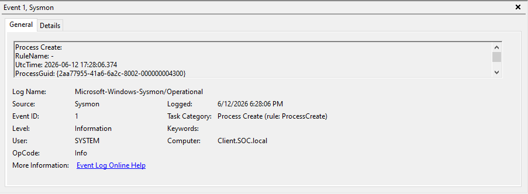
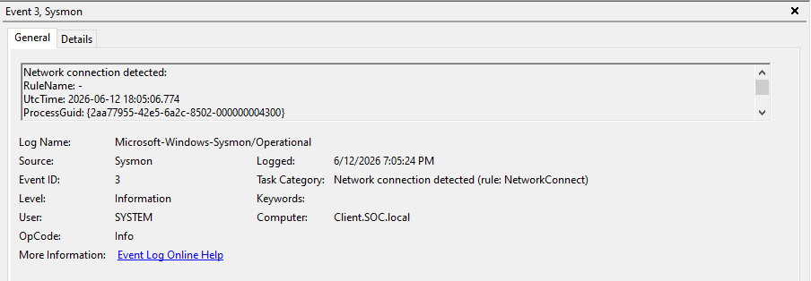
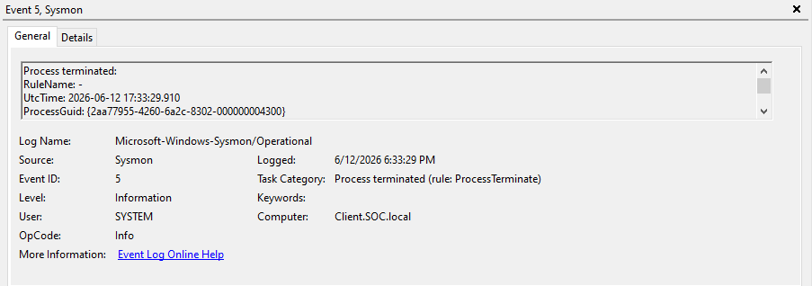

# Windows Sysmon Telemetry

## Purpose

Sysmon was installed on the Windows 10 endpoint to collect detailed endpoint telemetry such as process creation, network connections, and process termination events.

## Endpoint

| Item | Value |
|---|---|
| Hostname | Client.SOC.local |
| Operating System | Windows 10 Pro |
| Telemetry Source | Microsoft-Windows-Sysmon/Operational |

## Key Sysmon Events Collected

| Event ID | Event Name | Why It Matters |
|---|---|---|
| 1 | Process Create | Shows new processes executed on the endpoint |
| 3 | Network Connection | Shows outbound or inbound network connections |
| 5 | Process Terminated | Shows when a process exits or is stopped |

## Evidence

| Evidence | Screenshot |
|---|---|
| Sysmon Event ID 1 - Process Create |  |
| Sysmon Event ID 3 - Network Connection |  |
| Sysmon Event ID 5 - Process Terminated |  |

## Validation

Sysmon is successfully generating telemetry from the Windows endpoint. The screenshots confirm that Sysmon logs are available in Event Viewer under:

```text
Microsoft-Windows-Sysmon/Operational
