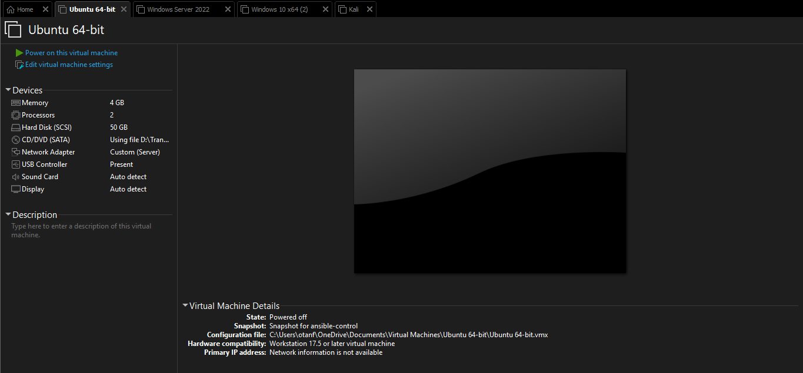

# Lab Setup

## Purpose

This lab simulates a small enterprise security environment used to practice detection engineering, SIEM monitoring, attack simulation, and incident response.

The environment is designed around a monitored Windows endpoint, an Active Directory server, a Wazuh SIEM server, and a Kali Linux attacker machine used only for controlled testing.

## Lab Design

All virtual machines are connected to the same isolated host-only network:

```text
Network: 10.0.0.0/24
Type: Host-only
```

The host-only network keeps the lab isolated while allowing the machines to communicate with each other.

## Virtual Machines

| Machine | Operating System | Role | IP Address |
|---|---|---|---|
| Windows Server | Windows Server Datacenter 2022 | Active Directory and DNS | 10.0.0.10 |
| Ubuntu Server | Ubuntu Server | Wazuh Manager on Docker | 10.0.0.20 |
| Windows Endpoint | Windows 10 Pro | Target endpoint with Wazuh Agent | 10.0.0.30 |
| Kali Linux | Kali Linux | Attacker machine for simulations | 10.0.0.99 |

## Security Workflow

The lab follows this workflow:

```text
Kali Linux
-> Windows 10 target activity
-> Windows Security Logs and Sysmon telemetry
-> Wazuh Agent
-> Wazuh Manager
-> Alerts and investigation
-> Incident response report
```

## Current Status

| Component | Status |
|---|---|
| Host-only network | Completed |
| Windows Server | Completed |
| Ubuntu Wazuh server | Completed |
| Windows 10 endpoint | Completed |
| Kali attacker machine | Completed |

## Evidence

| Evidence | Screenshot |
|---|---|
| VM list showing all lab machines |  |
| Host-only network settings |  |
| Ping test between machines |  |
| Wazuh dashboard access |  |
| Windows agent active in Wazuh |  |


