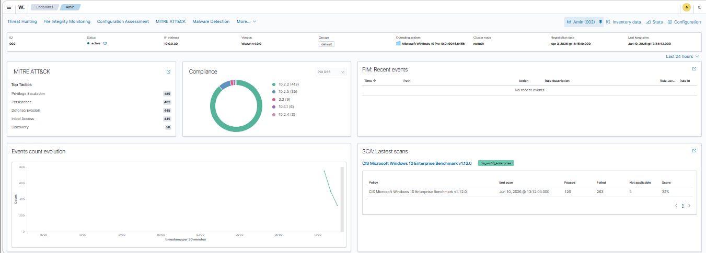
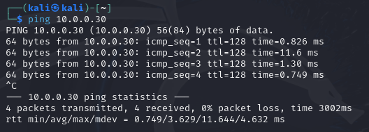
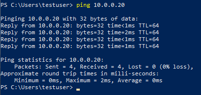
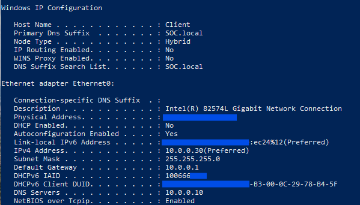

# Network And Assets

## Network Overview

The lab uses one isolated host-only network for all machines.

| Setting | Value |
|---|---|
| Network type | Host-only |
| Network range | 10.0.0.0/24 |
| Default lab subnet | 10.0.0.0 |
| DNS server | 10.0.0.10 |

## Asset Inventory

| Asset | IP Address | Role | Notes |
|---|---|---|---|
| Windows Server Datacenter 2022 | 10.0.0.10 | Active Directory and DNS | Provides domain and name resolution services |
| Ubuntu Server | 10.0.0.20 | Wazuh SIEM server | Runs Wazuh Manager using Docker |
| Windows 10 Pro | 10.0.0.30 | Monitored endpoint | Target machine with Wazuh Agent and Sysmon |
| Kali Linux | 10.0.0.99 | Attacker machine | Used for controlled attack simulations |

## Communication Flow

| Source | Destination | Purpose |
|---|---|---|
| Windows 10 Pro | Windows Server | Domain and DNS communication |
| Windows 10 Pro | Ubuntu Server | Wazuh Agent log forwarding |
| Kali Linux | Windows 10 Pro | Controlled attack simulation |
| Ubuntu Server | Windows 10 Pro | Agent management and monitoring |

## Important Services

| Service | Host | Purpose |
|---|---|---|
| DNS | Windows Server - 10.0.0.10 | Name resolution for the lab |
| Active Directory | Windows Server - 10.0.0.10 | Identity and domain services |
| Wazuh Manager | Ubuntu Server - 10.0.0.20 | SIEM rule processing and alert generation |
| Wazuh Agent | Windows 10 Pro - 10.0.0.30 | Endpoint log collection |
| Sysmon | Windows 10 Pro - 10.0.0.30 | Endpoint telemetry collection |

## Validated Checks

- Windows 10 can reach the Ubuntu Wazuh server `10.0.0.20`
- Kali Linux can reach the Windows 10 target `10.0.0.30`
- Windows 10 uses the Windows Server DNS `10.0.0.10`
- Wazuh Agent on Windows 10 is active and connected to Wazuh Manager

## Evidence

| Evidence | Screenshot |
|---|---|
| Wazuh agent active on Windows 10 endpoint |  |
| Kali Linux can reach Windows 10 target |  |
| Windows 10 can reach Ubuntu Wazuh server |  |
| Windows 10 uses Windows Server DNS |  |
