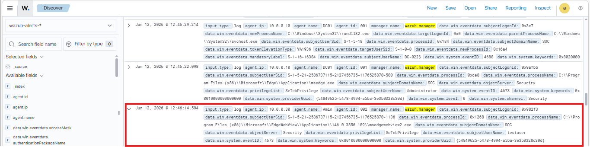

# Agent And Log Collection

## Purpose

Document the Windows endpoint connection to Wazuh and confirm that endpoint logs are being collected.

## Endpoint Overview

| Item | Value |
|---|---|
| Endpoint | Windows 10 Pro |
| IP Address | 10.0.0.30 |
| Agent | Wazuh Agent |
| Wazuh Manager | 10.0.0.20 |

## Collected Log Sources

At this stage, the goal is to confirm that the Windows endpoint is sending normal telemetry to Wazuh before attack simulations.

| Log Source | Purpose | Status |
|---|---|---|
| Windows Security Events | Authentication and security activity | Connected |
| Wazuh Agent Events | Agent health and communication status | Connected |
| Sysmon Events | Endpoint process, network, and registry telemetry | Planned / To validate |

## Validation

- The Windows endpoint appears as active in Wazuh.
- Wazuh receives Windows Security events from the endpoint.
- Attack simulations are not required at this stage.

## Evidence

| Evidence | Screenshot |
|---|---|
| Windows endpoint agent is active in Wazuh |  |
| Windows Security events are received in Wazuh |  |

## Status

Agent connection and basic Windows log collection completed.
